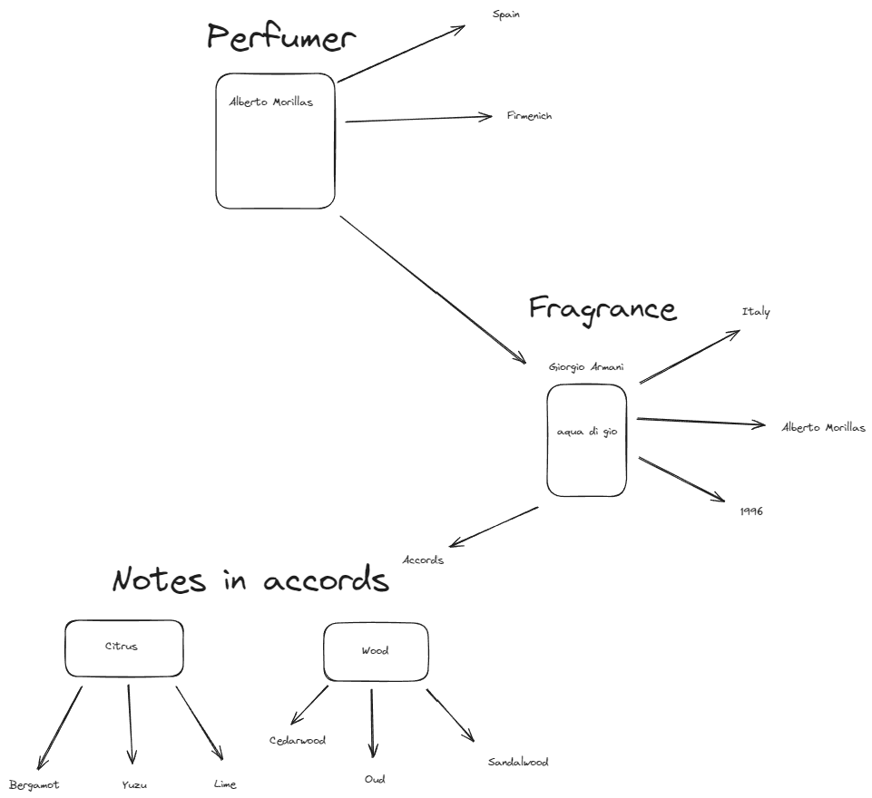

# Scentra

- Content Navigation
    - [Introduction](#introduction)
    - [Description](#description)
    - [Scentra features](#scentra-features)
    - [Technologies](#technologies)
    - [Architecture](#architecture)
    - [Possible use cases](#possible-use-cases)
    - [ER Diagram Sketch](#er-diagram-sketch)
    - [ER Diagram Implementation](#er-diagram-implementation)
    - [API Documentation](#api-documentation)
    - [Containerize](#containerize)
    - [Hosting](#hosting)
    - [Testing](#testing)
    - [JPA (Java Persistence API)](#jpa-java-persistence-api)
    - [Lombok](#lombok)
    - [Controllers](#controllers)
    - [Services](#services)
    - [Summary](#summary)

# Introduction

- This project serves as a demonstration of my technical skills and self-evaluation, focusing on the process of building
  a
  project from concept and design to implementation using enterprise-grade technologies. The primary objective is to
  standardize solutions while exploring best practices in software development.

- Rather than emphasizing the originality of the project idea, the focus lies in its role as a catalyst for igniting my
  passion and interest in the development process. This project is an opportunity to apply and refine newly acquired
  methods, concepts, and frameworks in a practical setting.

- This project not only highlights my understanding of backend development but also showcases my ability to integrate
  advanced concepts and frameworks into a cohesive solution.

# Description

- **"Scentra"** (or **"Essentique"**) is a REST API designed for managing and exploring fragrance data. It provides
  essential CRUD operations, enabling users to search for fragrances by name, country, or browse by accords.
- The **Scentra API** is a RESTful service built using **Java Spring Boot** that provides endpoints to manage
  fragrance-related data, including brands, perfumers, accords, and notes. Designed for perfume enthusiasts and
  researchers, this API enables efficient searching, filtering, and managing of fragrance records.
- It uses **PostgreSQL** for persistence, follows **REST principles**, and is containerized with **Docker** for
  deployment. The project
  emphasizes scalability and performance, supporting integration with microservices.

`Key features include:`

- **User Management**: Users can create accounts and save their favorite fragrances for future reference.
- **Administrative Control**: Administrators have the ability to manage the fragrance database, including adding,
  updating, or removing entries.
- **Search and Browse**: Powerful search capabilities allow users to find fragrances by specific criteria or explore
  various accords.

# Scentra features

- **Fragrance Management**: Create, update, delete, and retrieve fragrance records with details such as name, brand,
  year of creation, and country of origin.
- **Perfumer Profiles**: Maintain a database of perfumers, their details, and their contributions to fragrances.
- **Accords and Notes**: Manage fragrance accords (categories) and notes (specific ingredients), with relationships
  defined for each fragrance.
- **Search & Filter**: Support advanced searching and filtering of fragrances by name, brand, perfumer, accord, or year.
- **Data Relationships**: Handles complex many-to-many relationships (e.g., fragrances associated with multiple
  perfumers).
- **RESTful API Design**: Provides clean and standard endpoints for integration into any platform or frontend system.
- **Error Handling**: Implements structured error responses for improved client-side debugging.
- **Documentation**: Includes self-documented endpoints with tools like Swagger/OpenAPI.

# Technologies

- **Backend Framework**: Java with Spring Boot.
- **Database**: PostgreSQL.
- **Build Tool**: Maven for project build and dependency management.
- **Containerization**: Docker for containerizing the application.
- **Hosting/Deployment**: AWS Elastic Beanstalk, Render (cloud platform).
- **Testing**: JUnit and MockMVC for unit and integration testing.

# Architecture

- **Modular Design**: Divided into controllers, services, and repositories for separation of concerns.
- **Database Schema**: Relational schema linking fragrances, perfumers, accords, and notes with necessary relationships.

# Possible use cases

- **Perfume Brands**: Manage their collections and related data for marketing or inventory purposes.
- **Perfume Enthusiasts**: Search for perfumes by notes, accords, or perfumer profiles.
- **Research Institutions**: Analyze fragrance trends, ingredients, and historical data.
- **Developers**: Integrate the API into a frontend or mobile app for end-user interaction.

# ER Diagram Sketch

- The initial sketch of the entities and their relationships provides a clear visual representation of the data model
  for a fragrance database.
  

# ER Diagram Implementation

- The optimized entity-relationship (ER) diagram showcases a well-structured database where normalization and the use of
  junction tables ensure data integrity, minimize redundancy, and improve scalability.

### Fragrance Table

- The fragrance table is optimized to ensure all non-key attributes are fully dependent on the primary key (
  fragrance_id). This eliminates transitive dependencies and ensures the table adheres to Third Normal Form (3NF).

```
Attributes:
        fragrance_id (Primary Key): Uniquely identifies a fragrance.
        name (Text): Stores the name of the fragrance.
        year (Integer): Represents the year of creation.
        brand_id (Foreign Key): Links to the brand table.
```

### Brand Table

- By moving brand into its own table, we reduce data redundancy and enable efficient management of brand-related
  attributes.

- The brand table allows centralized management of brand information, reducing redundancy when multiple fragrances share
  the same brand.

```
Attributes:
        brand_id (Primary Key): Uniquely identifies a brand.
        name (Text): Stores the name of the brand.
        country_id (Foreign Key): Links to the country table.
        Additional fields, such as the founding year or logo URL, can be added here for further scalability.
```

- This approach simplifies updates (e.g., modifying a brand’s name or country) and ensures consistency across fragrances
  associated with the same brand.

### Country Table

- The country table is designed to store country names shared by multiple entities, such as fragrance, brand, and
  perfumer. This ensures consistent naming and avoids redundancy.

```
Attributes:
        country_id (Primary Key): Uniquely identifies a country.
        name (Text): Stores the name of the country.
        image_url (Optional): Can store a flag or visual representation.
```

- By using a shared country table, both fragrances and perfumers can reference the same country entity, ensuring data
  consistency and minimizing redundant country data across tables.

### Concentration Table

- Fragrances can exist in multiple concentrations (e.g., EDC, EDT, EDP, Parfum). Creating a concentration table improves
  scalability by storing these variations centrally.

```
Attributes:
        concentration_id (Primary Key): Uniquely identifies a concentration.
        name (Text): Describes the concentration type (e.g., "EDP").
        description (Text): Provides additional details about the concentration.
```

### Fragrance-Concentration Junction Table

- The fragrance_concentration table facilitates a many-to-many relationship between fragrance and concentration. Each
  fragrance can exist in multiple concentrations, and each concentration can apply to multiple fragrances.

```
Attributes:
        fragrance_id (Primary Key): References the fragrance entity.
        concentration_id (Primary Key): References the concentration entity.
```

- This junction table ensures that any new concentration type can be added without impacting the core fragrance or
  concentration tables.

### Notes and Accords

```
    The note and accord tables manage the hierarchical structure of fragrance compositions:
        accord: Represents broad scent categories (e.g., Citrus, Woody).
        note: Represents specific scent ingredients (e.g., Bergamot, Cedarwood) and is linked to accord.
```

- By organizing note and accord data into separate tables, the database design supports detailed queries (e.g., "Find
  all
  fragrances with Citrus accords") while avoiding duplication.

### Junction Tables for Many-to-Many Relationships

- The optimized design includes several junction tables to handle many-to-many relationships effectively:

```
fragrance_perfumer:
        Connects fragrances to their creators (perfumers).
        Allows multiple perfumers to be associated with a single fragrance.
        
perfumer_brand:
        Links perfumers to the brands they collaborate with.
        Enables tracking of perfumer-brand relationships over time.
```


# API Documentation

- A full list of endpoints is documented using OpenAPI (Swagger) to provide a clear overview of the available operations
  and data structures.

### **Base URL**

`/api/v1`

---

### **Endpoints**

#### 1. **Get All Concentrations**

- **URL**: `/api/v1/concentrations`
- **Method**: `GET`
- **Description**: Retrieve a list of all fragrance concentrations.
- **Request**: None
- **Response**:
    - **Status Code**: `200 OK`
    - **Body**:

        ```json
        [
          {
            "id": 1,
            "name": "Eau de Parfum",
            "description": "High concentration of perfume oils."
          },
          {
            "id": 2,
            "name": "Eau de Toilette",
            "description": "Medium concentration of perfume oils."
          }
        ]
        ```

---

#### 2. **Get Concentration By ID**

- **URL**: `/api/v1/concentrations/{id}`
- **Method**: `GET`
- **Description**: Retrieve details of a specific concentration by its ID.
- **Path Parameter**:
    - `id` (Long): ID of the concentration to retrieve.
- **Request**: None
- **Response**:
    - **Status Code**: `200 OK`
    - **Body**:

        ```json
        {
          "id": 1,
          "name": "Eau de Parfum",
          "description": "High concentration of perfume oils."
        }
        ```

- **Error Response**:
    - **Status Code**: `404 Not Found`
    - **Body**:

        ```json
        {
          "error": "Concentration not found"
        }
        ```

---

#### 3. **Create a New Concentration**

- **URL**: `/api/v1/concentrations`
- **Method**: `POST`
- **Description**: Create a new fragrance concentration.
- **Request**:
    - **Body**:

        ```json
        {
          "name": "Eau de Cologne",
          "description": "Low concentration of perfume oils."
        }
        ```

    - **Validation**:
        - `name`: Required, string.
        - `description`: Optional, string.
- **Response**:
    - **Status Code**: `201 Created`
    - **Headers**:
        - `Location`: URL of the created resource (e.g., `/api/v1/concentrations/3`).
    - **Body**:

        ```json
        {
          "id": 3,
          "name": "Eau de Cologne",
          "description": "Low concentration of perfume oils."
        }
        ```

---

#### 4. **Update an Existing Concentration**

- **URL**: `/api/v1/concentrations/{id}`
- **Method**: `PUT`
- **Description**: Update an existing fragrance concentration.
- **Path Parameter**:
    - `id` (Long): ID of the concentration to update.
- **Request**:
    - **Body**:

        ```json
        {
          "name": "Eau de Parfum Intense",
          "description": "Very high concentration of perfume oils."
        }
        ```

    - **Validation**:
        - `name`: Required, string.
        - `description`: Optional, string.
- **Response**:
    - **Status Code**: `200 OK`
    - **Body**:

        ```json
        {
          "id": 1,
          "name": "Eau de Parfum Intense",
          "description": "Very high concentration of perfume oils."
        }
        ```

- **Error Response**:
    - **Status Code**: `404 Not Found`
    - **Body**:

        ```json
        {
          "error": "Concentration not found"
        }
        ```

---

#### 5. **Delete a Concentration**

- **URL**: `/api/v1/concentrations/{id}`
- **Method**: `DELETE`
- **Description**: Delete an existing fragrance concentration by ID.
- **Path Parameter**:
    - `id` (Long): ID of the concentration to delete.
- **Request**: None
- **Response**:
    - **Status Code**: `204 No Content`
    - **Body**: None
- **Error Response**:
    - **Status Code**: `404 Not Found`
    - **Body**:

        ```json
        {
          "error": "Concentration not found"
        }
        ```

---

### **Error Codes**

- `400 Bad Request`: Validation error in the request body.
- `404 Not Found`: Resource not found.
- `500 Internal Server Error`: Unexpected server error.

---

# **Containerize**

- To manage containerized services efficiently, `docker-compose` is used to orchestrate multiple containers from a
  single configuration file. Each service (e.g., Spring Boot application, database) runs in its own container,
  maintaining isolation. These containers communicate with each other through a bridge network set up in
  the `docker-compose.yml` file, ensuring seamless interaction while persisting shared context.

---

# **Hosting**

#### **Render**:

- Render provides an easy and efficient solution for hosting Spring Boot applications directly from a GitHub repository.
  By leveraging the `Dockerfile` in the repository, Render builds and deploys the application, abstracting much of the
  complexity involved in manual setup.

#### **AWS Elastic Beanstalk**:

AWS Elastic Beanstalk (EBS) is used for hosting Spring Boot applications, but careful configuration is needed:

- EBS operates on **port 5000**, while the default Spring Boot application runs on **port 8080**.
- To ensure compatibility, you can either:
    - Modify `application.properties` to set `server.port=5000`.
    - Configure AWS to map EBS's port 5000 to your Spring Boot application's port 8080 during environment creation or
      using EC2 configurations.

---

# **Testing**

- Initially, **Test-Driven Development (TDD)** was adopted to write controllers. This approach involved writing tests
  before the implementation to ensure functionality met requirements. However, as development progressed, TDD was not
  consistently followed across the entire project. Adhering to TDD throughout the project would have made the
  application more resilient to changes and regressions.

---

# **JPA (Java Persistence API)**

#### **Entity Relationships**:

1. **One-to-Many and Many-to-One**:

- Example: A `Perfumer` entity has a `Country`.
- The "many" side (e.g., `Perfumer`) manages the relationship and is mapped by the "one" side (`Country`).

2. **Avoiding Infinite Recursion**:

- For bidirectional relationships, avoid recursion by:
    - Excluding `toString`, `equals`, and `hashCode` methods from referencing the inverse side.
    - Using annotations like `@JsonIgnore` or `@JsonBackReference` to prevent serialization loops.

3. **Many-to-Many**:

- Example: `Fragrance` and `Perfumer` have a many-to-many relationship.
- A join table is automatically created by JPA, but the owning and inverse sides must be clearly defined.
- Use `@JsonIgnore` on the owner side (`Fragrance`) and `@JsonBackReference` on the inverse side (`Perfumer`) to handle
  serialization properly.

#### **Design Considerations**:

- For complex bidirectional relationships, plan the application design and architecture carefully from the outset.
  Mismanagement of these relationships can lead to serialization errors, difficulty in testing, and architectural
  inefficiencies.

---

### **Lombok**

- Lombok simplifies the codebase significantly by generating boilerplate code such as getters, setters, constructors,
  and more through annotations. However, it is crucial to use Lombok annotations judiciously to avoid unintended
  behaviors and maintain readability.

---

### **Controllers**

- Each entity has its own controller to handle incoming requests and delegate them to the corresponding CRUD methods in
  the service layer. More complex controllers, such as those for `Fragrance` and `Perfumer`, manage additional
  functionalities due to the intricate relationships between entities. For example:

- A `Fragrance` controller logically manages collections of `Notes`, ensuring cohesion and proper encapsulation of
  responsibilities.

---

### **Services**

- Separate service classes are implemented for each controller to maintain the **separation of concerns**. This approach
  prevents controllers from handling business logic directly. For more complex entities like `Fragrance`:

- Dedicated services are created to manage indirect dependencies on related entities.
- This avoids reusing existing entity services, which could lead to **circular dependencies** and architectural issues.

---

### **Summary**

- The design philosophy focuses on modularity, maintainability, and scalability:

- Containers are efficiently managed using `docker-compose`.
- Hosting solutions like Render and AWS EBS are configured to align with deployment needs.
- TDD and JPA relationship best practices ensure a robust and well-tested application.
- Lombok and dedicated service classes streamline code and maintain clear boundaries between responsibilities.
